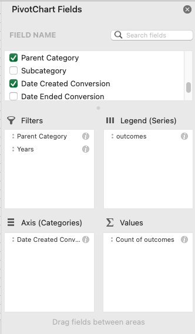
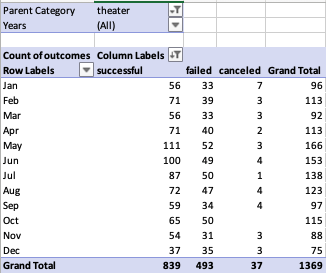
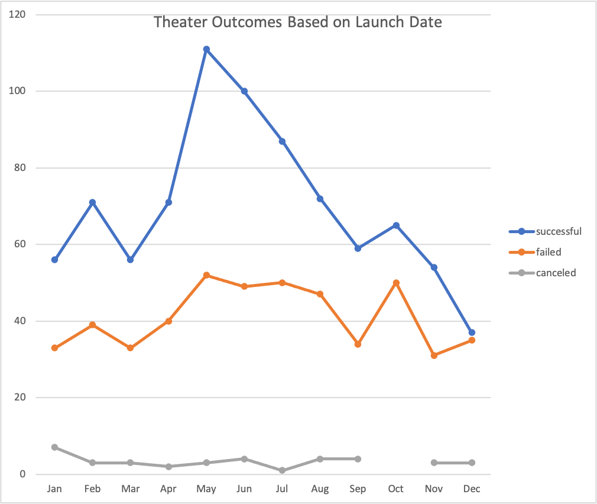
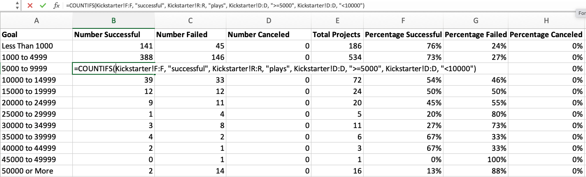
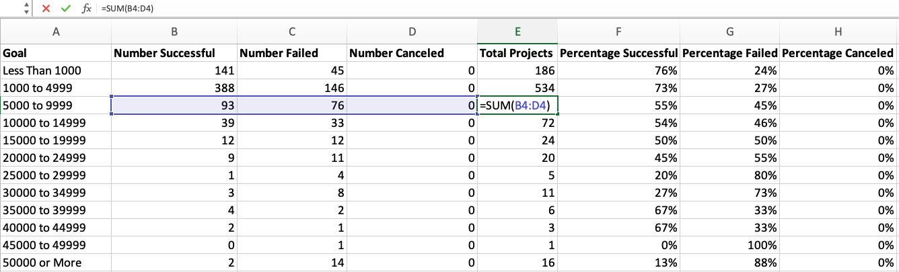
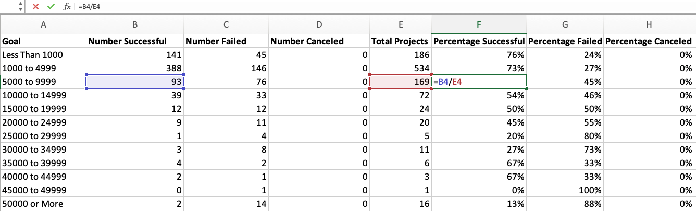
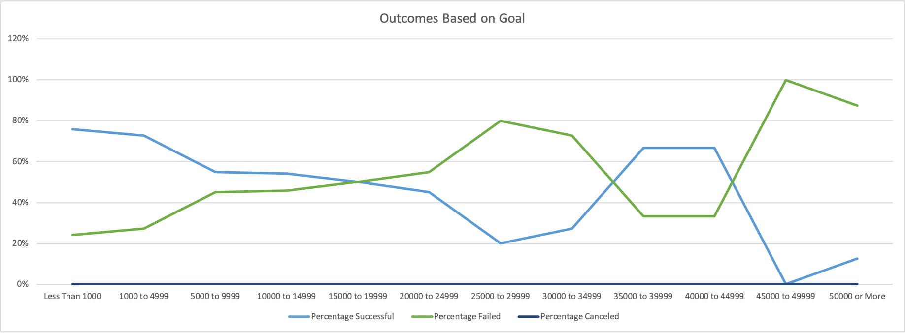

# Kickstarting with Excel
Note: The analysis for this project is done using Microsoft Excel per the course assignment. A Google Sheets version of this exercise is available at this [link](https://docs.google.com/spreadsheets/d/1uUfEns8cXFOpEkDU9x2qz302lodEJ1FB/edit?usp=sharing&ouid=113127303755755666272&rtpof=true&sd=true).

## Overview of Project

### Purpose
In this section I explain the purpose of the analysis. 

In this analysis, we are using Excel for data analytics to demonstrate how data can be used to tell a story and answer specific questions. We use Excel to:

- Import data into a table for analysis.
- Apply filters, conditional formatting, and formulas.
- Generate and interpret pivot tables.
- Calculate summary statistics such as measures of central tendency, standard deviation, and variance.
- Characterize data to identify outliers in datasets.
- Perform an Excel analysis with visualizations.
- Interpret common Excel visualizations

Louise wants to analyze the factors that influence the success of her Kickstarter project campaign. We`ll be performing data analysis on several thousand crowdfunding projects to uncover any hidden trends. We are creating visualization of the data so that Louise can see the outcomes of all the campaign categories.  We use Pivot Charts to complement pivot tables by using table data to creat visualizations such as line charts.

For the Challenge in Module 1, we are building on data analysis that was performed during the learning module and create two new analyses: outcomes based on goals and outcomes based on launch date. Louise wants to know how different campaigns fared in relation to their launch dates and their funding goals. Using the Kickstarter dataset we are visualizing campaign outcomes based on their launch dates and their funding goals. 

## Analysis and Challenges

The analysis is performed in an Excel file. You can follow along in the analysis by downloading and opening the [Kickstarter_Challenge.xlsx](resources/Kickstarter_Challenge.xlsx) file.
To analyse the Kickstarter data, we perform the following steps building on the lessons in the module:
- Create a new column "Years" using the `YEAR()` function in Excel and extract the year based on data in the "Date Created Conversion" column.
- Create a pivot table.
- Filter a pivot table based on “Parent Category.”
- Create a chart from a pivot table.
- Annotate and save charts as a PNG.
- Reducing the number of items in the Rows field to a single item.

### Analysis of Outcomes Based on Launch Date
In this section, I describe how the analysis for Outcomes Based on Launch Date was performed. I describe the steps using images and links to code.

I created a pivot table from the KickStarter worksheet, and placed the pivot table in a new sheet that I labeled "Theater Outcomes by Launch Date." I filter the pivot table based on "Parent Category" and "Years."  Then, I placed the appropriate pivot table fields in the columns, rows, and values and filtered the column labels to show only "successful," "failed," and "canceled." I grouped the "Row Labels" column to show only the month of the year by removing Year and Quarter selections from the Rows selection field. 
The PivotChart Fields selection in my "Theater Outcomes by Launch Date" sheet look as follows:

Excel generated a Pivot table based on my Field selection. Then I filtered the "Parent Category"  to show only the data for "theater" and sorted the campaign outcomes in descending order so "successful" is first. My final Pivot Table looks as follows:

Finally, I created a line chart from the pivot table to visualize the relationship between outcomes and launch month. I gave the line chart the title "Theater Outcomes Based on Launch Date" and saved the chart as an image.  The final line chart looks as follows:

### Analysis of Outcomes Based on Goals
In this section, I describe how the analysis for Outcomes Based on Goals was performed. I describe the steps using images and links to code.

The goal of the analysis for Outcomes Based on Goals is to visualize the percentage of successful, failed, and canceled plays based on the funding goal amount. I used the `COUNTIFS()` function in Excel to collect the outcome and goal data for the “plays” subcategory.

I created a new sheet "Outcomes Based on Goals" with the following columns:
- Goal
- Number Successful
- Number Failed
- Number Canceled
- Total Projects
- Percentage Successful
- Percentage Failed
- Percentage Canceled

In the "Goal" column, I created ranges for dollar-amounts so projects can be grouped based on their goal amount as follows:
- Less Than 1000
- 1000 to 4999
- 5000 to 9999
- 10000 to 14999
- 15000 to 19999
- 20000 to 24999
- 25000 to 29999
- 30000 to 34999
- 35000 to 39999
- 40000 to 44999
- 45000 to 49999
- 50000 or More

I used `COUNTIFS()` functions to populate the "Number Successful," "Number Failed," and "Number Canceled" columns by filtering on the Kickstarter "outcome" column, on the "goal" amount column using the ranges created above, and on the "Subcategory" column using "plays" as the criteria.

The following diagram shows an example `COUNTIFS()` function for successful Kickstarter projects in the "plays" subcategory with a goal amount between 5000 and 9999.

Next, I used the `SUM()` function to populate the "Total Projects" column with the number of successful, failed, and canceled projects for each row.  The following diagram shows an example of the `SUM()` function for total number of successful, failed, and canceled projects with the goal amount range between 5000 and 9999.

I also calculated the percentage of successful, failed, and canceled projects for each row using a formula and converting the field type to Percentage as shown in the following diagram:

Finally, I created a line chart titled "Outcomes Based on Goal" to visualize the relationship between the goal-amount ranges on the x-axis and the percentage of successful, failed, or canceled projects on the y-axis. The diagram looks as follows:

### Challenges and Difficulties Encountered

I did not encounter any challenges in this assignment. However, potential challenges that students could encounter include the following:

- When populating the `COUNTIFS()` function in the sheet "Outcomes Based on Goals", the functions in cells B2:D13 need to be individualized to match the cell range and outcome type. Students might have difficulty when copying the cells because the references to the cells and selection criteria in the Kickstarter sheet need to be changed. For example, when copying the formula from cell B2 to cell C2, Excel changes the range of cells for outcomes from Kickstarter!F:F to Kickstarter!G:G because all cells are shifted to the right by one column. If students don`t correct the cell references, they would reference the incorrect column in the Kickstarter sheet and end up with incorrect results.  Similarly, when copying the content of cell B2 into cells B3 through B13, students might forget to update the goal range and end up with the same data in every field. 
- When making the field selection for the PivotTable Fields, the selection for Year and Quarter need to be removed from "Rows" to end up with the month as Row Labels.  Students might forget to remove these selections and end up with a different row label.

## Results

I can draw the following two conclusions about the Outcomes based on Launch Date:
1. Kickstarter campaigns in the Parent Category "Theater" have the highest outcome of "successful" in the months May, June, and July. 
2. Kickstarter campaigns in the Parent Category "Theater" have the lowest outcome of "successful" when launched in the month of December. Almost half of the campaigns that are launched in the month of December failed.  

I can draw the following conclusions about the Outcomes based on Goals:
1. Campaigns in the "theater" category with a subcategory of "plays" with a goal over 45000 have a high percentage of failures and are unlikely to succeed. Only 2 out of 17 campaigns with a goal above 45000 were successful.
2. Campaigns in the "theater" category with a subcategory of "plays" with a goal range between 25000 and 35000 also have a high percentage of failures and are less likely to succeed. Only 4 out of 16 campaigns in this goal range were successful.
3. The best chance of success for campaigns in the "theater" category with a subcategory of "plays" is in the goal range below 10000 and between 35000 and 45000. 
4. Almost half of the campaigns in the "theater" category with a subcategory of "plays" are in the range 1000 to 4999 and have a high success rate of 73%.  
5. There are no canceled campaigns for campaigns in the "theater" category with a subcategory of "plays". The campaigns either succeeded or failed.

- What are some limitations of this dataset?
1. The dataset does not provide data on who submitted the campaign. There could be a correlation on the characteristics of the campaign submitter and the outcome of the campaign.

- What are some other possible tables and/or graphs that we could create?
1. What influence does a Staff Pick or Spotlight have on the outcome of the campaign?
2. Are campaigns more successful in certain countries than others?
3. Are campaigns more successful in certain currencies than others?
4. Does the Duration of the campaign influence the outcome?
5. What campaigns/subcategories draw the highest number of backers?
6. How close did failed campaigns come to succeeding? Was the target way off or did they just miss the goal?